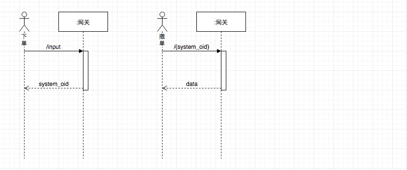
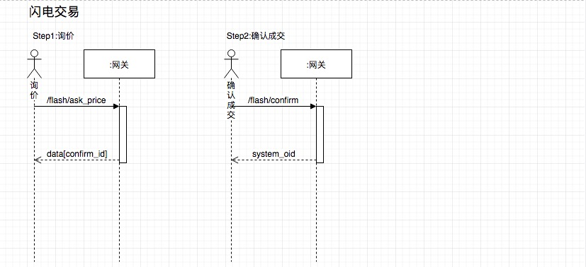
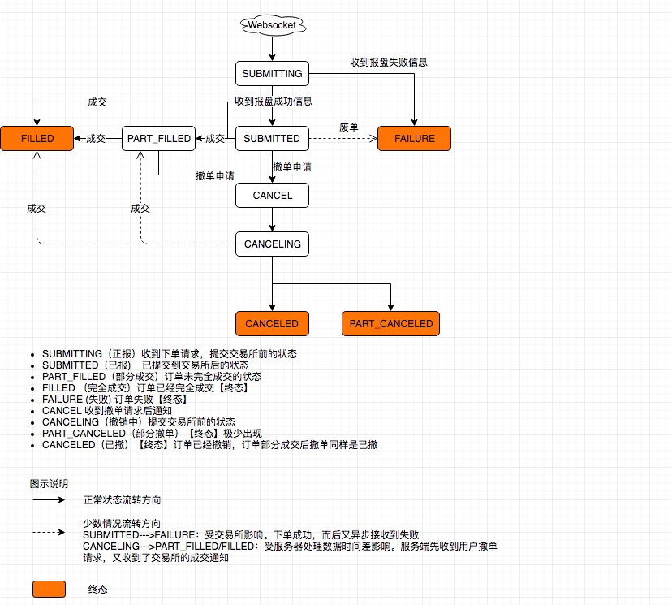

# 第三方接口文档

## 1. 查询账户列表

```tex
接口用途: 查询账户列表

请求方式: GET

接口地址Path: https://open.lmt.trade/api/v1/account/list
```

#### 输入参数:

| 参数名称 | 参数类型 | 是否必须 | 参数解释                |
| -------- | -------- | -------- | ----------------------- |
| 无 |     |        | |

#### 返回数据:

```json
{
    "code": "200",
    "data": [
        {
            "asset_code": 190810230,
            "status":1,
            "is_sub_account":0
        },
        {
           "asset_code": 190810234,
           "status":1,
           "is_sub_account":1
        },
     ]
    "message":"SUCESS"
}
```

#### 备注:

```tex
asset_code 子账户编码 用于查询子账户余额、子账户下单、子账户闪电下单、查询子账户订单等
status 账户状态 1 启用 2 冻结 3 注销. 冻结通常由于资产风控导致的冻结,资产调整或手动恢复启用;注销通常是一种强制性封锁账户,无法恢复启用状态
is_sub_account 是否子账户 0不是(即该账户是母账户,也是默认账户) 1是
```

## 2. 添加子账户

```tex
接口用途: 添加子账户

请求方式: POST

接口地址Path: https://open.lmt.trade/api/v1/account/add_sub_account
```

#### 输入参数:

| 参数名称 | 参数类型 | 是否必须 | 参数解释                |
| -------- | -------- | -------- | ----------------------- |
| timestamp | Long    | 是       | 全局自增序列 建议使用时间戳(单位ms)|

#### 返回数据:

```json
{
    "code": "200",
    "data": {
        "asset_code": 190810234
    }
    "message":"SUCESS"
}
```

#### 备注:

```tex
asset_code 子账户编码 用于查询子账户余额、子账户下单、子账户闪电下单、查询子账户订单等
```

## 3. 获取账户资产信息

```tex
接口用途: 获取账户资产信息

请求方式: GET

接口地址Path: https://open.lmt.trade/api/v1/account/get
```

#### 输入参数:

| 参数名称 | 参数类型 | 是否必须 | 参数解释                |
| -------- | -------- | -------- | ----------------------- |
| timestamp | Long    | 是       | 全局自增序列 建议使用时间戳(单位ms)|
| asset_code | Long    | 否       | 账户编码 不填默认查询母账户,否则需要输入该母账户下的子账户编码|

#### 返回数据:

```json
{
    "code": "200",
    "data": [
        {
            "balance":"1.01",
            "currency":"BTC",
            "frozen":"0",
            "market_value":"9898.5656"
        },
        {
            "balance":"9800.56",
            "currency":"USDT",
            "frozen":"0.982",
            "market_value":"9800.56"
        }
    ],
    "message":"SUCESS"
}
```

#### 备注:

```tex
balance:余额

market_value:USDT市值

frozen:冻结金额

currency:币种

可用余额部分=余额-冻结金额
```


## 4. 子账户资产划转

```tex
接口用途: 子账户资产划转

请求方式: POST

接口地址Path: https://open.lmt.trade/api/v1/account/transfer
```

#### 输入参数:

| 参数名称 | 参数类型 | 是否必须 | 参数解释                |
| -------- | -------- | -------- | ----------------------- |
| timestamp | Long    | 是       | 全局自增序列 建议使用时间戳(单位ms)|
| asset_code | Long    | 是       | 只能是子账户编码|
| currency | String    | 是       | 币种|
| balance | String    | 是       | 划转数量金额|
| transfer_type | String    | 是       | 划转类型 IN:划入子账户 OUT:划出子账户|

#### 返回数据:

```json
{
    "code": "200",
    "data": [
        {
            "balance":"1.01",
            "currency":"BTC",
            "frozen":"0",
            "market_value":"9898.5656"
        },
        {
            "balance":"9800.56",
            "currency":"USDT",
            "frozen":"0.982",
            "market_value":"9800.56"
        }
    ],
    "message":"SUCESS"
}
```

#### 备注:

```tex
输出子账户的最新资产信息

balance:余额

market_value:USDT市值

frozen:冻结金额

currency:币种

可用余额部分=余额-冻结金额
```

## 5. 创建订单(币币交易、杠杆交易)

```tex
接口用途: 创建订单

请求方式: POST

接口地址Path: https://open.lmt.trade/api/v1/trade/input
```

#### 输入参数:

| 参数名称      | 参数类型 | 是否必须 | 参数解释                                      |
| ------------- | -------- | -------- | --------------------------------------------- |
| trade_type       | String   | 是       | 交易类型:spot币币交易,margin杠杆交易,目前该接口仅支持spot,闪电交易见接口13,14          |
| symbol      | String   | 是       | 币币交易对                     |
| price_type    | String   | 是       | 市价:market      限价: limit                |
| entrust_price | String   | 否       | 委托价格                                      |
| entrust_amount   | String   | 是       | 委托量 限价买、卖、市价卖是数量，市价买 暂不支持 |
| entrust_bs    | String   | 是       | 买:buy       卖:sell                        |
| client_oid    | String   | 否       | 来源标记                                      |
| timestamp | Long    | 是       | 全局自增序列 建议使用时间戳(单位ms)|
| program_oid | Long    | 否       | 程序单ID |
| asset_code | Long    | 否       | 账户编码 不填默认以母账户下单,否则需要输入该母账户下的子账户编码|

#### 返回数据:

```json
{
    "code": "200",
    "data": {
        "client_oid":"12345",
        "system_oid":"125520129039151104"
    },
    "message":"SUCESS"
}
```

#### 备注:

```tex
client_oid: 客户生成订单ID

system_oid: 系统生成的订单ID

备注:当下单的价格类型为限价单时，必须传入entrust_price参数和entrust_amount参数，当委托价格类型为为市价单时，必须传入entrust_amount参数
```

## 6. 查询单个订单信息

```tex
接口用途: 查询订单信息

请求方式: GET

接口地址Path: https://open.lmt.trade/api/v1/trade/order
```

#### 输入参数:

| 参数名称   | 参数类型 | 是否必须 | 参数解释                                 |
| ---------- | -------- | -------- | ---------------------------------------- |
| system_oid | String   | 是       | 系统订单号 |
| timestamp | Long    | 是       | 全局自增序列 建议使用时间戳(单位ms)|

#### 返回数据:

```json
{
    "code": "200",
    "data": {
            "exchange":"LMT",
            "average_dealt_price":"0.000011655",
            "client_oid":"12345",
            "commission":"0.00000011655",
            "symbol":"ADA_BTC",
            "dealt_amount":"10",
            "entrust_amount":"10",
            "entrust_bs":"sell",
            "price_type":"limit",
            "entrust_price":"0.000011",
            "entrust_time":"2018-12-10 10:08:43",
            "lever":"1",
            "profit_value":"0",
            "status":5,
            "stop_value":"0",
            "system_oid":"125520129039151104",
            "trade_type":"spot",
            "margin_mode":"none",
            "asset_code":190810234
     }
    "message":"SUCESS"
}
```

#### 备注:

```tex
exchange:交易所名称

entrust_bs:委托方向,buy买，sell卖

price_type:委托类型 market市价,limit限价

future_dir:期货方向，open开，close平（币币交易时忽略该字段）

client_oid:客户的生成订单ID

status:2正报 3已报 4部分成交 5完全成交 6废单 11撤单 12正撤 13待撤 14部分撤单15已撤

entrust_price:委托价

entrust_amount:委托量

entrust_time:委托时间

average_dealt_price:平均成交价

dealt_amount:已成交数量

lever:杠杆 （币币交易时忽略该字段）

profit_value:止盈价格（币币交易时忽略该字段）

stop_value:止损价格（币币交易时忽略该字段）

commission:手续费

trade_type:spot:币币交易 flash:闪电交易

margin_mode:保证金类型 crossed全仓 fixed逐仓 none不区分,仅杠杆交易订单使用

asset_code:账户编码

备注:请求参数传入为空时，视为查询该参数所有类型的订单数据
```

## 7. 查询活跃订单

```tex
接口用途: 查询活跃订单

请求方式: GET

接口地址Path: https://open.lmt.trade/api/v1/trade/open_orders
```

#### 输入参数:

| 参数名称      | 参数类型 | 是否必须 | 参数解释                                       |
| ------------- | -------- | -------- | ---------------------------------------------- |
| exchange      | String   | 否       | 交易所名称 目前仅支持 LMT、INSTANTEX                     |
| symbol      | String   | 否       | 币币交易对或合约名称                           |
| from    | String   | 否       | 起始查询的系统委托单号 从最早下单开始排序                 |
| limit | String   | 否       | 一次查询最大数量 最大100 默认100                            |
| timestamp | Long    | 是       | 全局自增序列 建议使用时间戳(单位ms)|
| asset_code | Long    | 否       | 账户编码 不填默认以母账户查询,否则需要输入该母账户下的子账户编码|

#### 返回数据:

```json
{
    "code": "200",
    "data":{
        "orderDetailRes":[
            "exchange":"LMT",
            "average_dealt_price":"0.000011655",
            "client_oid":"12345",
            "commission":"0.00000011655",
            "symbol":"ADA_BTC",
            "dealt_amount":"10",
            "entrust_amount":"10",
            "entrust_bs":"sell",
            "price_type":"limit",
            "entrust_price":"0.000011",
            "entrust_time":"2018-12-10 10:08:43",
            "lever":"1",
            "profit_value":"0",
            "status":5,
            "stop_value":"0",
            "system_oid":"125520129039151104",
            "trade_type":"spot",
            "margin_mode": "none",
            "asset_code":190810234
            ],...
        "nextFrom":"125520129039151104"
     }
    "message":"SUCESS"
}
```
#### 备注:
```tex
    各字段含义同单个订单接口
```


## 8. 创建合约订单

```tex
接口用途: 创建合约订单 

请求方式: POST

接口地址Path: https://open.lmt.trade/api/v1/trade/input
```

#### 输入参数:

| 参数名称      | 参数类型 | 是否必须 | 参数解释                                                     |
| ------------- | -------- | -------- | ------------------------------------------------------------ |
| trade_type    | String   | 是       | 交易类型:future合约交易          |
| symbol        | String   | 是       | 币币交易对或合约名称                                         |
| price_type    | String   | 是       | 市价:market      限价: limit                               |
| entrust_price | String   | 否       | 委托价格，市价时无需传入                                     |
| profit_value  | String   | 否       | 止盈价                       |
| stop_value    | String   | 否       | 止损价                            |
| entrust_vol   | String   | 是       | 委托量               |
| entrust_bs    | String   | 是       | 买:buy       卖:sell                                       |
| future_dir    | String   | 否       | 开仓:open   平仓: close                                    |
| lever         | String   | 否       | 杠杆倍数                                                     |
| client_oid    | String   | 否       | 客户自定义ID，合约平仓需指定的持仓单号                       |
| timestamp | Long    | 是       | 全局自增序列 建议使用时间戳(单位ms)|
| asset_code | Long    | 否       | 账户编码 不填默认以母账户下单,否则需要输入该母账户下的子账户编码|

#### 返回数据:

```json
{
    "code": "200",
    "data": {
        "client_oid":"12345",
        "system_oid":"125520129039151104"
    },
    "message":"SUCESS"
}
```

#### 备注:

```tex
client_oid: 客户生成订单ID

system_oid: 系统生成的订单ID

说明: 此接口和创建订单接口的URL是相同的，两个接口调同一个URL。为了区分普通BB订单和合约订单，文档说明上，对两个接口分开说明

备注:当下单的价格类型为限价单时，必须传入entrust_price参数和entrust_vol参数，当委托价格类型为为市价单时，必须传入entrust_vol参数。平仓时，若有指定的仓位ID（deal_id），表示只对该仓位进行平仓，此时无需读取平仓规则参数；若平仓命令中无指定仓位ID，则按指定平仓规则进行平仓。
```

## 9. 平仓

```tex
接口用途: 合约平仓

请求方式: POST

接口地址Path: https://open.lmt.trade/api/v1/trade/close
```

#### 输入参数:

| 参数名称      | 参数类型 | 是否必须 | 参数解释                                       |
| ------------- | -------- | -------- | ---------------------------------------------- |
| symbol      | String   | 是       | 币币交易对或合约名称                           |
| price_type    | String   | 是       | 市价:market      限价: limit                 |
| entrust_price | String   | 否       | 委托价格， 限价必传                            |
| entrust_vol   | String   | 是       | 委托量 |
| entrust_bs    | String   | 是       | 买:buy       卖:sell                         |
| deal_id       | String   | 否       | 平仓持仓号，合约平仓需指定的持仓单号           |
| client_oid    | String   | 否       | 客户端标识                                     |
| close_rule    | String   | 否       | 平仓规则,可选值为time 、risk                   |
| timestamp | Long    | 是       | 全局自增序列 建议使用时间戳(单位ms)|

#### 返回数据:

```json
{
    "code": "200",
    "data": {
        "client_oid":"12345",
        "system_oid":"125520129039151104,125520129039151105"
    },
    "message":"SUCESS"
}
```

#### 备注:

```tex
client_oid: 客户生成订单ID

system_oid: 系统生成的订单ID（可能存在多个，多个system_oid用逗号隔开）

close_rule 平仓规则，可选值为time、risk。 time:按时间排序优先平仓， risk按风险值（接近平仓的程度）优先平仓。

注意: deal_id和close_rule不可同时为空。 两者都不为空时，即按照deal_id平仓（忽略close_rule)。
```

## 10.取消订单

```tex
接口用途: 取消订单

请求方式: DELETE

接口地址Path: https://open.lmt.trade/api/v1/trade/order/{system_oid}
```

#### 输入参数:

| 参数名称   | 参数类型 | 是否必须 | 参数解释                                 |
| ---------- | -------- | -------- | ---------------------------------------- |
| system_oid | String   | 是       | 系统生成的订单号，逗号分隔，最多支持15个 |

#### 返回数据:

```json
{
    "code": "200",
    "data": {
        "SUCCESS": [
            {
                "system_oid":"1255201290344176419"
            }
        ],
        "ERROR": [
            {
                "system_oid":"125520129039151104"
            }
        ]
    },
    "message":"SUCESS"
}
```

#### 备注:

```tex
闪电交易订单无法取消

code: 状态码 

message: 状态信息 

data: 撤单信息
```


## 11.  查询合约持仓

```tex
接口用途: 查询合约持仓信息

请求方式: GET

接口地址Path: https://open.lmt.trade/api/v1/trade/position
```

#### 输入参数:

| 参数名称     | 参数类型 | 是否必须 | 参数解释                      |
| ------------ | -------- | -------- | ----------------------------- |
| symbol     | String   | 否       | 合约名称                      |
| position_dir | String   | 否       | 持仓方向，多:buy   空: sell |

#### 返回数据:

```json
{
    "code": "200",
    "data": [
        {
            "close_profit":"0",
            "symbol":"BTC_USDT_181229",
            "dealId":"221595144918675467",
            "force_price":"0.00000502",
            "lever":"1",
            "margin":"0.00001004",
            "open_price":"0.00001004",
            "position_dir":"buy",
            "position_profit":"-0.00000124",
            "position_value":"1",
            "vol":"1",
            "asset_code":190810234
        }
    ],
    "message":"SUCESS"
}
```

#### 备注:

```tex
symbol:合约名称

position_dir:持仓方向，buy多，sell空

vol: 持有合约数量

cost:合约开仓价值

margin:合约持仓保证金

close_profit: 已实现盈亏

position_profit: 浮动盈亏

open_price:开仓价

position_value:持仓价值

force_price:强平价

lever:杠杆

asset_code:账户编码

备注:请求参数传入为空时，视为查询该参数所有类型的订单数据
```


## 12.  查询成交纪录

```tex
接口用途: 查询成交纪录

请求方式: GET

接口地址Path: https://open.lmt.trade/api/v1/trade/trans
```

#### 输入参数:

| 参数名称 | 参数类型 | 是否必须 | 参数解释                |
| -------- | -------- | -------- | ----------------------- |
| exchange | String   | 是       | 目前仅支持 LMT、INSTANTEX    |
| symbol | String   | 是       | 币币交易对或合约名称    |
| count    | int      | 是       | 查询数量 最大50         |
| asset_code | Long    | 否       | 账户编码 不填默认以母账户查询,否则需要输入该母账户下的子账户编码|

#### 返回数据:

```json
{
    "code": "200",
    "data": [
        {
            "exchange":"OKEX",
            "commission":"0.001",
            "commission_currency":"BTC",
            "symbol":"ADA_BTC",
            "dealt_amount":"1",
            "dealt_price":"0.00001176",
            "dealt_time":"2018-11-29 16:19:09",
            "entrust_bs":"buy",
            "future_dir":"币币交易，不区分",
            "system_oid":"121606988609761289",
            "system_tid":"221619148110966794",
            "asset_code":190810234
        },
        {
            "exchange":"INSTANTEX",
            "commission":"0.2",
            "commission_currency":"BTC",
            "symbol":"ADA_BTC",
            "dealt_amount":"200",
            "dealt_price":"0.00001176",
            "dealt_time":"2018-11-29 16:19:33",
            "entrust_bs":"buy",
            "future_dir":"币币交易，不区分",
            "system_oid":"121606988609761290",
            "system_tid":"221619148110966795",
            "asset_code":190810234
        }
    ],
    "message":"SUCESS"
}
```

#### 备注:

```tex
exchange : 币币交易成交发生的真实交易所，但需注意查询统一输入参数LMT；闪电交易统一输入参数INSTANTEX

entrust_bs:买卖方向

future_dir:期货方向

client_oid:客户端自定义id

commission: 手续费

commission_currency: 手续费币种

symbol:合约代码

dealt_amount: 成交数量

dealt_price:成交价格

dealt_time: 成交时间

system_oid:平台委托单号

system_tid:平台成交编号

asset_code:账户编码
```


## 13.  闪电交易询价(预成交)

```tex
接口用途: 闪电交易询价

请求方式: POST

接口地址Path: https://open.lmt.trade/api/v1/trade/flash/ask_price
```

#### 输入参数:

| 参数名称 | 参数类型 | 是否必须 | 参数解释                |
| -------- | -------- | -------- | ----------------------- |
| symbol | String   | 是       | 闪电交易币对名称    |
| entrust_bs    | String      | 是       | 买卖方向: buy/sell        |
| entrust_type    | int      | 是       | 委托类型 1按买卖数量 2按买卖金额      |
| entrust_amount    | String      | 是       | 委托量       |

#### 返回数据:

```json
{
    "code": "200",
    "data":
        {
            "exchange":"INSTANTEX",
            "symbol":"BTC_USDT",
            "dealt_price":"10020.34",
            "dealt_amount":"0.023",
            "dealt_time":"2018-11-29 16:19:33",
            "confirm_id":"63ebfab2-c93a-11e9-a0f4-020f2d8eb122",
            "time_out":15
        }
    "message":"SUCESS"
}
```

#### 备注:

```tex
exchange: 闪电交易所名称
symbol: 币对名称
dealt_price: 预成交价格
dealt_amount: 预成交量 (按量委托等同于输入值,按额委托是根据价格计算后的值)
dealt_time: 预成交时间 (当在有效期内确认订单时,订单成交时间按此时间计入)
confirm_id: 确认订单号
time_out: 此次询价有效时长 单位 秒,接入方需在有效时长内，来确认该笔交易，否则该笔交易失效,见接口11.
```

## 14.  闪电交易确认成交

```tex
接口用途: 闪电交易确认成交

请求方式: POST

接口地址Path: https://open.lmt.trade/api/v1/trade/flash/confirm
```

#### 输入参数:

| 参数名称 | 参数类型 | 是否必须 | 参数解释                |
| -------- | -------- | -------- | ----------------------- |
| confirm_id | String   | 是       | 闪电交易确认单号    |
| client_oid    | String      | 否       | 客户端自定义id        |
| asset_code | Long    | 否       | 账户编码 不填默认以母账户下单,否则需要输入该母账户下的子账户编码|

#### 返回数据:

```json
{
    "code": "200",
    "data":
        {
            "system_oid":"1119809736219570194",
            "confirm_id":"63ebfab2-c93a-11e9-a0f4-020f2d8eb122",
            "client_oid":""
        }
    "message":"SUCESS"
}
```

#### 备注:

```tex
system_oid: 系统生成的订单ID
confirm_id: 确认订单号 同输入的确认单号
client_oid: 客户端自定义id
```

## 下单 撤单时序图


## 闪电交易时序图


## 订单状态机
